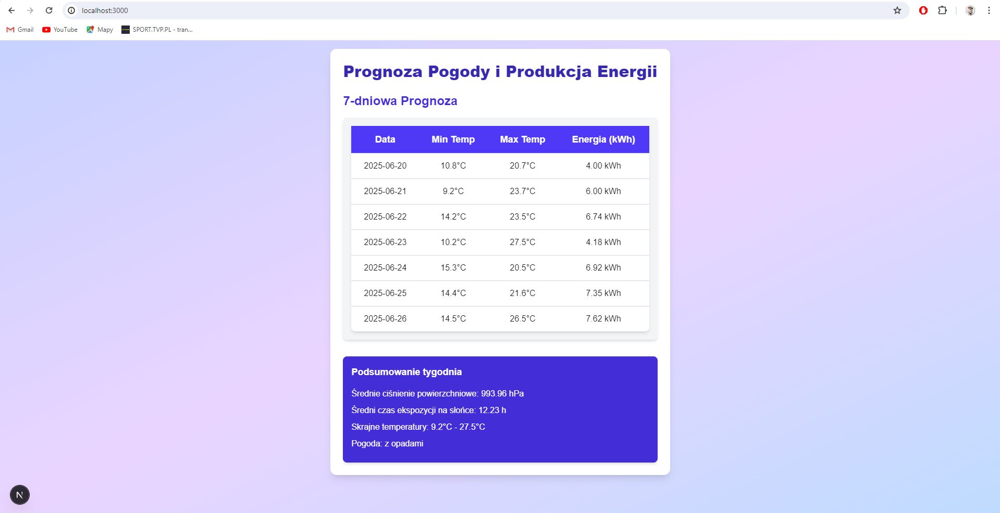

# Solar Weather Forecast

https://letter-sort.netlify.app/

The app displays a 7-day weather forecast and estimates the energy production from a photovoltaic system. It uses an external API (Open Meteo) to fetch weather data and calculates the estimated amount of energy in kWh that can be generated during a given period.

## Technologies

- **Frontend**: Next.js
- **Backend**: Node.js (Express)
- **API**: Open Meteo
- **Database**: None (All data comes from the API)

## Features

1. **Weather Forecast**:
   - Displays a 7-day weather forecast with minimum and maximum temperatures.
   - Shows the estimated solar energy production (in kWh) based on the sun exposure time.
   - Visualizes the weather data in a table with daily details.

2. **Weekly Summary**:
   - Displays the average pressure for the week.
   - Calculates the average sun exposure time.
   - Shows the extreme temperatures for the week.
   - Provides a brief summary of the expected weather conditions (with or without precipitation).

## Running

Start the backend server:
```bash
   node server.js
```

The backend will be available at: http://localhost:5000.

Start the frontend application:

```bash
   npm run dev
```

The frontend will be available at: http://localhost:3000.


